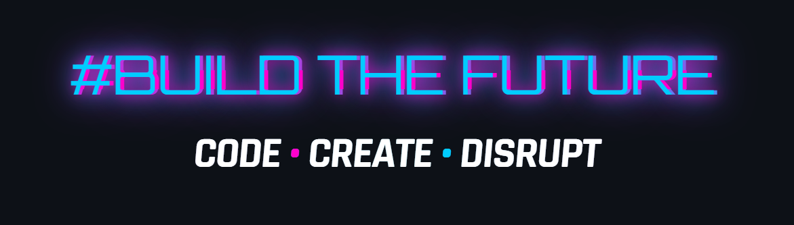

---



---

## 🚀 **IGNITION SEQUENCE**  
*Fueling the startup singularity*

```go
package universe

import (
	"innovation"
	"chaos"
)

func Main() {
	for {
		select {
		case <-coffee.Sip():
			idea := brainstorm(jetbrains.Overdrive())
			launch(mvp.Build(idea, 72))
		case <-market.Shift():
			pivot(metrics.Blitz())
		default:
			scale(infrastructure.Singularity())
		}
	}
}
```
<div align="center">

</div>  


---

## 💥 **CORE TECH STACK**  
*Weapons of mass construction*

<div align="center">
  <table>
    <tr>
      <td align="center" width="140">
        
        <br>
        <div style="background: #ff00cc; color: black; padding: 5px; border-radius: 20px; margin-top: 10px; font-weight: 800; font-size: 0.8rem;">GOLANG</div>
      </td>
      <td align="center" width="140">
        
        <br>
        <div style="background: #00ccff; color: black; padding: 5px; border-radius: 20px; margin-top: 10px; font-weight: 800; font-size: 0.8rem;">DOCKER</div>
      </td>
      <td align="center" width="140">
        
        <br>
        <div style="background: #ff00cc; color: black; padding: 5px; border-radius: 20px; margin-top: 10px; font-weight: 800; font-size: 0.8rem;">K8S</div>
      </td>
      <td align="center" width="140">
        
        <br>
        <div style="background: #00ccff; color: black; padding: 5px; border-radius: 20px; margin-top: 10px; font-weight: 800; font-size: 0.8rem;">REDIS</div>
      </td>
    </tr>
    <tr>
      <td align="center" width="140">
        
        <br>
        <div style="background: #00ccff; color: black; padding: 5px; border-radius: 20px; margin-top: 10px; font-weight: 800; font-size: 0.8rem;">POSTGRES</div>
      </td>
      <td align="center" width="140">
        
        <br>
        <div style="background: #ff00cc; color: black; padding: 5px; border-radius: 20px; margin-top: 10px; font-weight: 800; font-size: 0.8rem;">PYTHON</div>
      </td>
      <td align="center" width="140">
        
        <br>
        <div style="background: #00ccff; color: black; padding: 5px; border-radius: 20px; margin-top: 10px; font-weight: 800; font-size: 0.8rem;">MONGODB</div>
      </td>
      <td align="center" width="140">
        
        <br>
        <div style="background: #ff00cc; color: black; padding: 5px; border-radius: 20px; margin-top: 10px; font-weight: 800; font-size: 0.8rem;">KAFKA</div>
      </td>
    </tr>
    <tr>
      <td align="center" width="140">
        
        <br>
        <div style="background: #00ccff; color: black; padding: 5px; border-radius: 20px; margin-top: 10px; font-weight: 800; font-size: 0.8rem;">PROMETHEUS</div>
      </td>
      <td align="center" width="140">
        
        <br>
        <div style="background: #ff00cc; color: black; padding: 5px; border-radius: 20px; margin-top: 10px; font-weight: 800; font-size: 0.8rem;">GRAFANA</div>
      </td>
      <td align="center" width="140">
        
        <br>
        <div style="background: #00ccff; color: black; padding: 5px; border-radius: 20px; margin-top: 10px; font-weight: 800; font-size: 0.8rem;">ELASTICSEARCH</div>
      </td>
       <td align="center" width="140">
  
  <br>
  <div style="background: #00ccff; color: black; padding: 5px; border-radius: 20px; margin-top: 10px; font-weight: 800; font-size: 0.8rem;">gRPC</div>
      </td>

  </table>
</div>
  </table>
</div>

## 🌌 **COLLABORATION PROTOCOL**  
*Synapse connection for founders & disruptors*

<div align="center" style="background: linear-gradient(45deg, #000, #111); border: 3px solid #00ccff; border-radius: 20px; padding: 30px; margin: 40px 0; box-shadow: 0 0 40px #00ccff, 0 0 60px #ff00cc;">
  <h3 style="color: #ff00cc; text-transform: uppercase; letter-spacing: 5px; font-size: 2rem; margin-bottom: 25px; text-shadow: 0 0 15px #ff00cc;">
     FOUNDER MATRIX ACTIVATED
  </h3>
  
  <div style="background: rgba(0,0,0,0.7); padding: 20px; border-radius: 15px; margin: 20px auto; max-width: 600px;">
    <div style="display: flex; justify-content: center; gap: 20px; flex-wrap: wrap;">
      <div style="text-align: center; padding: 15px; border: 2px dashed #ff00cc; border-radius: 10px; flex: 1; min-width: 200px;">
        <h4 style="color: #00ccff; margin: 0 0 10px 0;">CO-FOUNDERS WANTED</h4>
        <p style="color: #fff; margin: 0;">Tech visionaries ready to build the next big thing</p>
      </div>
      
   <div style="text-align: center; padding: 15px; border: 2px dashed #00ccff; border-radius: 10px; flex: 1; min-width: 200px;">
        <h4 style="color: #ff00cc; margin: 0 0 10px 0;">PROJECT COLLABORATORS</h4>
        <p style="color: #fff; margin: 0;">Devs who ship fast and break things</p>
      </div>
    </div>
    
  
  <div style="display: flex; justify-content: center; gap: 30px; margin-top: 20px;">
    
  </div>
</div>


<div align="center"> <a href="https://t.me/infoowner">  </a> &nbsp;&nbsp;&nbsp; <a href="https://github.com/Arlandaren">
 <h3>COLLABORATION PROTOCOL ACTIVATED</h3> </div>


---

## 🔥 **MANIFESTO**  
*Principles of disruption*

<div style="display: grid; grid-template-columns: repeat(auto-fit, minmax(300px, 1fr)); gap: 25px; margin: 50px 0;">
  <div style="background: rgba(255,0,204,0.1); border-left: 5px solid #ff00cc; padding: 20px; border-radius: 0 15px 15px 0;">
    <h3 style="color: #ff00cc; margin-top: 0;">STARTUP VORTEX</h3>
    <p style="color: #00ccff;">72-hour MVP sprints • Fail spectacularly • Pivot at lightspeed • Scale exponentially</p>
  </div>
  
  <div style="background: rgba(0,204,255,0.1); border-left: 5px solid #00ccff; padding: 20px; border-radius: 0 15px 15px 0;">
    <h3 style="color: #00ccff; margin-top: 0;">BACKEND ALCHEMY</h3>
    <p style="color: #ff00cc;">10k RPS before breakfast • Distributed chaos engineering • Coffee-powered optimization</p>
  </div>
  
  <div style="background: rgba(255,0,204,0.1); border-left: 5px solid #ff00cc; padding: 20px; border-radius: 0 15px 15px 0;">
    <h3 style="color: #ff00cc; margin-top: 0;">FUTURE FOUNDRY</h3>
    <p style="color: #00ccff;">Disrupt legacy systems • Architect quantum-ready solutions • Build what doesn't exist</p>
  </div>
</div>

---

<div align="center" style="margin: 60px 0; position: relative;">
  
  <div style="position: absolute; top: 50%; left: 50%; transform: translate(-50%, -50%); text-align: center; width: 100%;">
    <h2 style="font-size: 3rem; background: linear-gradient(45deg, #ff00cc, #00ccff); -webkit-background-clip: text; -webkit-text-fill-color: transparent; text-shadow: 0 0 30px #ff00cc; margin: 0;">
      SYSTEMS ONLINE > READY TO DEPLOY
    </h2>
    <p style="color: #00ccff; font-size: 1.5rem; margin-top: 20px;">
      Let's build the future → tg:@infoowner
    </p>
  </div>
</div>
